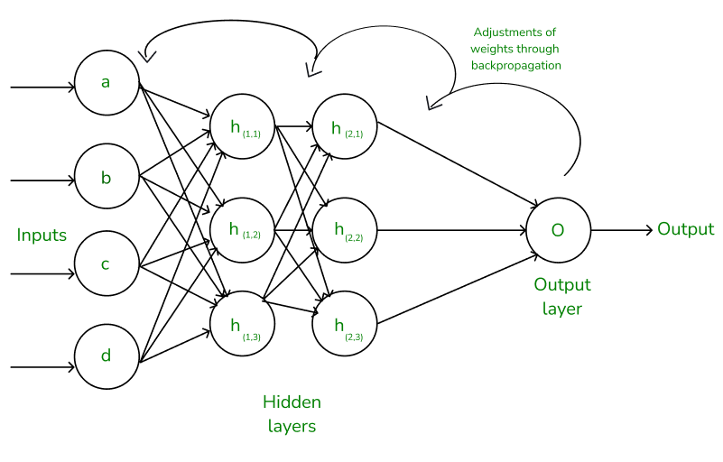

Deep learning : is a technique which basically mimics the human brain. So in 1950-60 reserchers and scientist thought can we make a machine work like how we human actually learn and we know that we will be learning from the environment with the help of our brain which has capacity to learn things very quickly. so that is where the deep learning concepts came and this thought led to the mention of something called as neural networks.

first simplest type of neural network is called perceptron. there were some problems in the perceptron and it was not able to learn very properly because of the concepts that were applied. later in 1980s researcher, scientist, teacher called Jeffrey Newton invented the concept called back propagation. because of this back propagation ANN, CNN and RNN became so efficient that many companies are now using it many people are using it and many people have developed a lot of application which are efficiently working because of Jeffrey Newton and his concepts of back propagation.

Backpropagation is a fundamental algorithm used in the training of neural networks, especially in deep learning models. It works by calculating the gradient of the loss function (the difference between predicted and actual values) with respect to the weights of the network and adjusting those weights to minimize the loss.

How Backpropagation Works:
Forward Pass:

Input data passes through the neural network layer by layer.
The output is computed based on the current weights and biases.
Loss Calculation:

The difference between the predicted output and the actual (true) output is computed using a loss function (e.g., Mean Squared Error for regression, Cross-Entropy for classification).
Backward Pass (Backpropagation):

The error is propagated back through the network, layer by layer, in reverse order.
Gradients of the loss function with respect to each weight are calculated using the chain rule of calculus.
Each weight is updated by a small step in the direction that reduces the loss, usually using a technique like gradient descent.
Weight Update:

The weights are adjusted to reduce the error.
This process continues iteratively over many cycles (epochs), and over time, the model improves its accuracy by minimizing the loss.
Key Concepts:
Activation Function: This function (like ReLU, Sigmoid, or Tanh) introduces non-linearity into the network and is essential for learning complex patterns.
Gradient Descent: A common optimization algorithm used in backpropagation to minimize the loss function. Variations like stochastic gradient descent (SGD), mini-batch gradient descent, and Adam are used to improve performance.
Learning Rate: A hyperparameter that controls how much to adjust the weights with each iteration.

.......................

1. Convolutional Neural Networks (CNNs)
CNNs are specialized for processing grid-like data, such as images, where spatial relationships are critical. They are commonly used in computer vision tasks like image classification, object detection, and segmentation.

Key Components of CNN:
Convolutional Layers:

These layers apply a set of filters (or kernels) to the input data, which helps extract features such as edges, textures, and shapes.
Convolution involves sliding the filter across the input and computing dot products.
Pooling Layers:

Pooling (e.g., max pooling) reduces the spatial dimensions of the data (height and width), retaining important features while reducing computational complexity and the risk of overfitting.
Fully Connected Layers:

After several convolutional and pooling layers, the output is typically flattened and fed into fully connected layers, similar to a traditional neural network.
This part of the network is responsible for final decision-making, such as classification.
Activation Functions:

ReLU (Rectified Linear Unit) is commonly used to introduce non-linearity after convolution operations.
Common Applications of CNNs:
Image classification (e.g., recognizing objects in images)
Object detection (e.g., identifying and localizing objects in images)
Image segmentation (e.g., dividing images into meaningful segments)
Video analysis
Example CNN Architecture:
Input layer (image)
Convolutional layer + ReLU
Pooling layer (e.g., Max pooling)
Convolutional layer + ReLU
Pooling layer
Fully connected layers
Output layer (e.g., Softmax for classification)
2. Recurrent Neural Networks (RNNs)
RNNs are designed for sequential data where temporal or ordered relationships are important. They are commonly used in natural language processing (NLP) and time-series analysis.

Key Feature of RNNs:
Recurrent Connections: Unlike CNNs, RNNs have loops that allow them to maintain an internal state (memory). This allows them to process sequences of data while retaining information from previous inputs.
How RNN Works:
Hidden State: RNNs maintain a hidden state, which gets updated at each time step as new data is fed into the network.
Sequence Processing: Each time step corresponds to a position in the sequence (e.g., a word in a sentence or a frame in a video), and the hidden state is updated based on the previous hidden state and the new input.
Limitations of RNNs:
Vanishing/Exploding Gradient: During backpropagation through time (BPTT), gradients can either become very small (vanishing) or very large (exploding), making it hard to learn long-term dependencies.
Enhancements to RNNs:
Long Short-Term Memory (LSTM) and Gated Recurrent Unit (GRU) are popular variants of RNNs that help mitigate the vanishing gradient problem and are better at capturing long-term dependencies in sequences.
Common Applications of RNNs:
Text generation (e.g., generating new text based on input sequences)
Language translation (e.g., translating one language to another)
Speech recognition (e.g., converting speech into text)
Time-series forecasting (e.g., predicting stock prices)
Example RNN Architecture:
Input layer (e.g., sequence of words)
RNN/LSTM/GRU layer
Output layer (e.g., predicting the next word in a sentence)
By providing/ingesting those features to each and every neuron present in that neural network will learn those information actually give you the output and with the help of back propagation it can train itself to learn new things.

| Feature | CNN  | RNN |
| --- | --- | --- |
| Primary Use | Image processing, spatial data | Sequence data, temporal data
| Architecture| Convolutional layers, pooling layers | Recurrent layers with hidden state
| Key Strength | Detects spatial hierarchies in data | Captures temporal patterns and dependencies
| Common Tasks| Image classification, object detection | Text generation, language translation
| Limitation | Struggles with sequential/temporal data | Struggles with long-term dependencies (without LSTM/GRU)
| Popular Variants | 3D CNNs (for video), ResNet, etc. | LSTM (Long Short-Term Memory) and GRU (Gated Recurrent Unit) 
