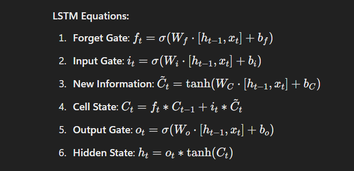
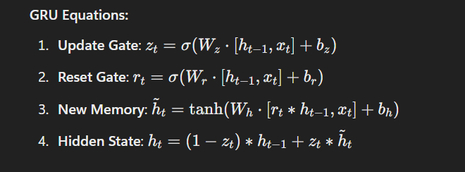

LSTM (Long Short-Term Memory) and GRU (Gated Recurrent Unit) are advanced types of recurrent neural networks (RNNs) designed to solve some of the problems that arise with traditional RNNs, especially the issue of vanishing or exploding gradients. Both LSTM and GRU help capture long-term dependencies in sequential data, making them widely used in tasks like natural language processing (NLP), time-series prediction, and more.

1. Long Short-Term Memory (LSTM)
LSTM networks are a specialized form of RNNs that use gates to regulate the flow of information, making them capable of learning long-term dependencies in sequences.

Key Components of LSTM:
Cell State: This is the “memory” of the network that runs through the entire sequence. It can be modified via gates and allows LSTM networks to retain or forget information over long periods.

Forget Gate: Determines how much of the previous cell state should be forgotten based on the current input and the previous hidden state. It uses a sigmoid function that outputs a value between 0 and 1, where 0 means "forget everything" and 1 means "keep everything."

Input Gate: Controls how much new information to add to the cell state. This gate also uses a sigmoid function to decide what part of the input should be updated in the cell state.

Output Gate: Determines the output of the current time step based on the cell state. It also uses a sigmoid activation function.

How LSTM Works:
At each time step, LSTM processes the current input and the previous hidden state (and cell state), updating the cell state through its gates. This mechanism allows it to retain important information over long sequences and forget irrelevant information.

LSTM Structure:
Forget Gate: Controls whether to retain or forget information from the previous time step.
Input Gate: Decides how much of the new input information should be stored in the cell state.
Cell State Update: Combines the forget and input gate outputs to update the cell state.
Output Gate: Controls the current hidden state and final output of the LSTM.
LSTM Equations:
# LSTM Equations

Applications of LSTM:
Text generation (generating text sequences based on previous context)
Machine translation (translating text from one language to another)
Speech recognition (converting spoken words into text)
Time-series prediction (predicting stock prices, weather, etc.)
2. Gated Recurrent Unit (GRU)
GRUs are a variant of LSTMs that simplify the architecture while retaining the ability to capture long-term dependencies in sequences. GRUs perform similarly to LSTMs but with fewer gates, making them computationally more efficient.

Key Differences from LSTM:
No Cell State: Unlike LSTMs, GRUs do not have a separate cell state. Instead, they directly operate on the hidden state.
Fewer Gates: GRUs combine the forget and input gates into a single gate called the update gate, reducing the complexity of the model. They also use a reset gate.
Key Components of GRU:
Update Gate: Controls how much of the previous hidden state should be passed to the next time step. It functions similarly to both the forget and input gates of an LSTM combined.

Reset Gate: Decides how much of the past information to forget. This gate allows the GRU to reset its memory when needed, especially for short-term dependencies.

How GRU Works:
At each time step, GRUs update their hidden state using the reset and update gates. Since there is no separate cell state, GRUs are simpler than LSTMs, but they still manage to retain long-term dependencies in sequences.

GRU Structure:
Update Gate: Controls how much of the previous hidden state should carry over to the current hidden state.
Reset Gate: Determines how much past information should be forgotten for the current input.
Hidden State Update: Combines information from the update and reset gates to update the hidden state.
GRU Equations:

Applications of GRU:
Text-based tasks (like machine translation or language modeling)
Speech synthesis (generating speech from text)
Music generation (composing new music based on existing patterns)
Time-series forecasting (simpler models for stock predictions, weather forecasting, etc.)
Comparison Between LSTM and GRU:
Feature	LSTM	GRU
Architecture	More complex (3 gates: input, forget, output)	Simpler (2 gates: update and reset)
Cell State	Separate cell state and hidden state	No separate cell state, operates directly on hidden state
Training Time	Slower due to more parameters	Faster training due to fewer parameters
Memory Usage	Higher memory usage	Lower memory usage
Performance	Good for long sequences and complex patterns	Good for shorter sequences and simpler patterns
Popular Use Cases	Complex sequences, long-term dependencies	Faster training on smaller datasets, simpler tasks
When to Use LSTM or GRU:
Use LSTM: When your data has very long-term dependencies that need to be captured (e.g., long sentences, long text sequences).
Use GRU: When you want a simpler, faster model that can still handle sequential data reasonably well, especially if training time or model complexity is a concern.

